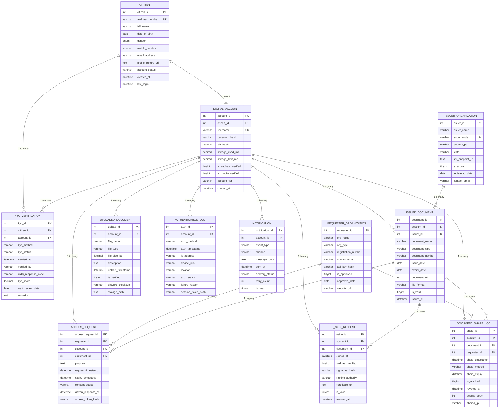

# Secure Identity System — Entity Relationship (ER) Diagram

```mermaid
erDiagram
    CITIZEN ||--o| DIGITAL_ACCOUNT : "1 to 0..1"
    CITIZEN ||--o{ KYC_VERIFICATION : "1 to many"

    DIGITAL_ACCOUNT ||--o{ ISSUED_DOCUMENT : "1 to many"
    DIGITAL_ACCOUNT ||--o{ UPLOADED_DOCUMENT : "1 to many"
    DIGITAL_ACCOUNT ||--o{ ACCESS_REQUEST : "1 to many"
    DIGITAL_ACCOUNT ||--o{ AUTHENTICATION_LOG : "1 to many"
    DIGITAL_ACCOUNT ||--o{ E_SIGN_RECORD : "1 to many"
    DIGITAL_ACCOUNT ||--o{ NOTIFICATION : "1 to many"
    DIGITAL_ACCOUNT ||--o{ KYC_VERIFICATION : "1 to many"
    DIGITAL_ACCOUNT ||--o{ DOCUMENT_SHARE_LOG : "1 to many"

    ISSUER_ORGANIZATION ||--o{ ISSUED_DOCUMENT : "1 to many"

    REQUESTER_ORGANIZATION ||--o{ ACCESS_REQUEST : "1 to many"
    REQUESTER_ORGANIZATION ||--o{ DOCUMENT_SHARE_LOG : "1 to many"

    ISSUED_DOCUMENT ||--o{ ACCESS_REQUEST : "1 to many"
    ISSUED_DOCUMENT ||--o{ E_SIGN_RECORD : "1 to many"
    ISSUED_DOCUMENT ||--o{ DOCUMENT_SHARE_LOG : "1 to many"

    CITIZEN {
        int citizen_id PK
        varchar aadhaar_number UK
        varchar full_name
        date date_of_birth
        enum gender
        varchar mobile_number
        varchar email_address
        text profile_picture_url
        varchar account_status
        datetime created_at
        datetime last_login
    }

    DIGITAL_ACCOUNT {
        int account_id PK
        int citizen_id FK
        varchar username UK
        varchar password_hash
        varchar pin_hash
        decimal storage_used_mb
        decimal storage_limit_mb
        tinyint is_aadhaar_verified
        tinyint is_mobile_verified
        varchar account_tier
        datetime created_at
    }

    ISSUER_ORGANIZATION {
        int issuer_id PK
        varchar issuer_name
        varchar issuer_code UK
        varchar issuer_type
        varchar state
        text api_endpoint_url
        tinyint is_active
        date registered_date
        varchar contact_email
    }

    ISSUED_DOCUMENT {
        int document_id PK
        int account_id FK
        int issuer_id FK
        varchar document_name
        varchar document_type
        varchar document_number
        date issue_date
        date expiry_date
        text document_uri
        varchar file_format
        tinyint is_valid
        datetime issued_at
    }

    UPLOADED_DOCUMENT {
        int upload_id PK
        int account_id FK
        varchar file_name
        varchar file_type
        decimal file_size_kb
        text description
        datetime upload_timestamp
        tinyint is_verified
        varchar sha256_checksum
        text storage_path
    }

    REQUESTER_ORGANIZATION {
        int requester_id PK
        varchar org_name
        varchar org_type
        varchar registration_number
        varchar contact_email
        varchar api_key_hash
        tinyint is_approved
        date approved_date
        varchar website_url
    }

    ACCESS_REQUEST {
        int access_request_id PK
        int requester_id FK
        int account_id FK
        int document_id FK
        text purpose
        datetime request_timestamp
        datetime expiry_timestamp
        varchar consent_status
        datetime citizen_response_at
        varchar access_token_hash
    }

    AUTHENTICATION_LOG {
        int auth_id PK
        int account_id FK
        varchar auth_method
        datetime auth_timestamp
        varchar ip_address
        varchar device_info
        varchar location
        varchar auth_status
        varchar failure_reason
        varchar session_token_hash
    }

    E_SIGN_RECORD {
        int esign_id PK
        int account_id FK
        int document_id FK
        datetime signed_at
        tinyint aadhaar_verified
        varchar signature_hash
        varchar signing_authority
        text certificate_url
        tinyint is_valid
        datetime revoked_at
    }

    NOTIFICATION {
        int notification_id PK
        int account_id FK
        varchar event_type
        varchar channel
        text message_body
        datetime sent_at
        varchar delivery_status
        int retry_count
        tinyint is_read
    }

    KYC_VERIFICATION {
        int kyc_id PK
        int citizen_id FK
        int account_id FK
        varchar kyc_method
        varchar kyc_status
        datetime verified_at
        varchar verified_by
        varchar uidai_response_code
        decimal kyc_score
        date next_review_date
        text remarks
    }

    DOCUMENT_SHARE_LOG {
        int share_id PK
        int account_id FK
        int document_id FK
        int requester_id FK
        datetime share_timestamp
        varchar share_method
        datetime share_expiry
        tinyint is_revoked
        datetime revoked_at
        int access_count
        varchar shared_ip
    }
```
